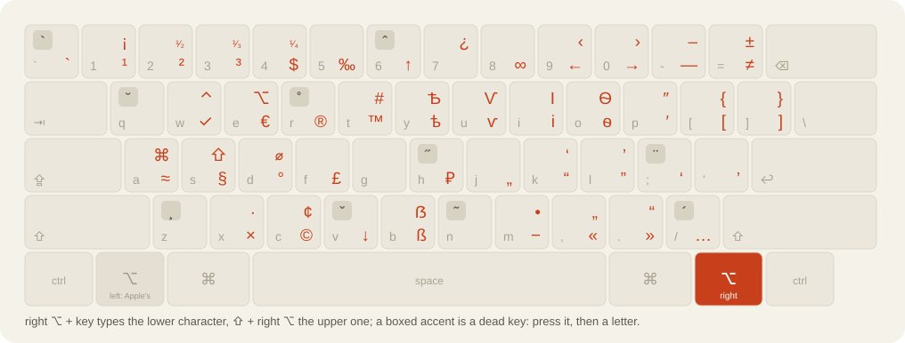

<p align="center"><b>English</b> · <a href="README.ru.md">Русский</a></p>

<h1 align="center">BirmanLayer</h1>

<p align="center">
Ilya Birman's typography layout on the right <b>⌥</b> key, over any keyboard layout you already use.<br>
Dashes, quotes, ©, €, ₽, accents and the stress mark, without giving up ABC, Russian or Greek.
</p>

<p align="center"></p>

> **Unofficial.** This is not Ilya Birman's layout and he is not involved. Every character and dead key is his;
> the Spoon only puts them on the right ⌥. Try the original too:
> [ilyabirman.ru/typography-layout](https://ilyabirman.ru/typography-layout/).

## What you get

| Press | Type |
| --- | --- |
| right ⌥ + `-` &nbsp; / &nbsp; ⇧ + right ⌥ + `-` | `—` &nbsp; / &nbsp; `–` |
| right ⌥ + `,` `.` | `«` `»` |
| right ⌥ + `c` `r` `h` | `©` `®` `₽` |
| right ⌥ + `2` &nbsp; / &nbsp; ⇧ + right ⌥ + `2` | `²` &nbsp; / &nbsp; `¹⁄₂` |
| ⇧ + right ⌥ + `/`, then `a` | `á` |
| ⇧ + right ⌥ + `/` twice, after a vowel | the stress mark |

Left ⌥ stays Apple's. It works on any layout: the layer is positional. Only the opt-in `baseFixups` names layouts (ABC, Russian – PC).

## Why a Spoon and not the layout

Personally, I did this for one reason: I wanted my **left ⌥ free for my own shortcuts** and the **right ⌥ left
to Birman**, the way it works on Windows. A Mac keyboard layout cannot do that: a layout does not know which of
the two Option keys was pressed, so his layout has to take both. Hammerspoon can tell them apart, and that is
the whole idea.

Beyond my own reason, replacing a keyboard layout works, until it does not:

- games, virtual machines and remote desktops often read raw key codes and do better with Apple's stock
  layouts, which you then cannot use;
- macOS may want a restart after a custom layout is installed, and switching between custom layouts is
  less reliable than between Apple's;
- you cannot turn it off for one app or tweak one character without opening a layout editor.

The Spoon keeps ABC, Russian, Greek or anything else you use and puts only the typographic part on the
one key that does nothing useful, like AltGr on Windows. It comes with an off switch per app, settings in a
few lines of Lua, and the same characters.

Already use Birman's layout? [docs/migrating.md](docs/migrating.md) moves you over in five minutes.

## Install

```sh
git clone https://github.com/servitola/BirmanLayer.spoon ~/.hammerspoon/Spoons/BirmanLayer.spoon
```

Then in `~/.hammerspoon/init.lua`:

```lua
hs.loadSpoon("BirmanLayer")
spoon.BirmanLayer:start()
```

Give Hammerspoon the **Accessibility** permission (System Settings → Privacy & Security → Accessibility). Right ⌥ + `c` types `©`.

## Settings

Nothing is required. Two things people change, before `start()`:

```lua
spoon.BirmanLayer.excludedBundles = { "com.example.game" }   -- stay silent in these apps
spoon.BirmanLayer.rightOptionOnly = false                    -- both ⌥ keys, as in Birman's Mac layout
```

Your own characters, dead keys and the rest: [docs/configuration.md](docs/configuration.md).
Also: [which key types what](docs/characters.md) · [how it works](docs/how-it-works.md) ·
[changelog](CHANGELOG.md).

## The original

Ilya Birman's layout is free, and it is his: the arrangement of the characters, the pictures, the name.
Everything worth loving here is from there: his [layout page](https://ilyabirman.ru/typography-layout/)
(downloads for Mac and Windows), the [FAQ](https://ilyabirman.ru/typography-layout/faq/) and the
[poster](https://ilyabirman.ru/typography-layout/poster/) with his own scheme of the keys, and his
[Telegram channel](https://t.me/ilyabirman_channel). The picture at the top of this page is drawn from the data,
not copied from his.

## Credits

Thanks to Ilya Birman, https://ilyabirman.ru/typography-layout/: the layout, the dead keys and every character
table are his work. The Spoon only makes it easy to use on a Mac next to the layouts you already have.
Code: MIT, © servitola.
