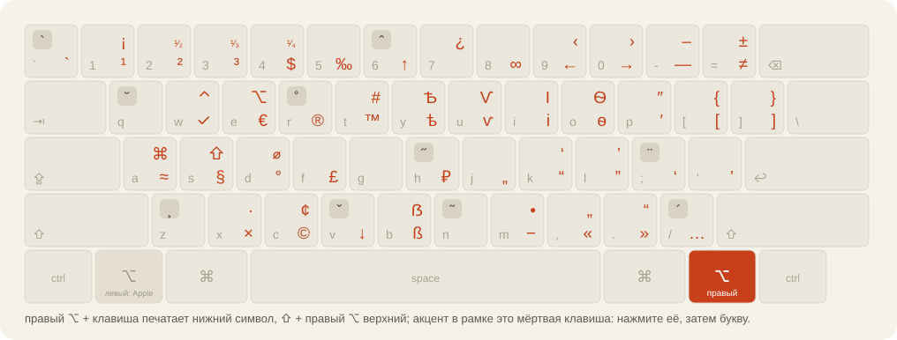

<p align="center"><a href="README.md">English</a> · <b>Русский</b></p>

<h1 align="center">BirmanLayer</h1>

<p align="center">
Типографская раскладка Ильи Бирмана на правом <b>⌥</b>, поверх любой раскладки, которой вы уже пользуетесь.<br>
Тире, кавычки, ©, €, ₽, акценты и знак ударения, без отказа от ABC, русской или греческой раскладки.
</p>

<p align="center"></p>

> **Неофициально.** Это не раскладка Ильи Бирмана, и он к ней не причастен. Все символы и мёртвые клавиши его,
> Spoon только переносит их на правый ⌥. Оригинал тоже стоит попробовать:
> [ilyabirman.ru/typography-layout](https://ilyabirman.ru/typography-layout/).

## Что получится

| Нажать | Напечатается |
| --- | --- |
| правый ⌥ + `-` &nbsp; / &nbsp; ⇧ + правый ⌥ + `-` | `—` &nbsp; / &nbsp; `–` |
| правый ⌥ + `,` `.` | `«` `»` |
| правый ⌥ + `c` `r` `h` | `©` `®` `₽` |
| правый ⌥ + `2` &nbsp; / &nbsp; ⇧ + правый ⌥ + `2` | `²` &nbsp; / &nbsp; `¹⁄₂` |
| ⇧ + правый ⌥ + `/`, затем `a` | `á` |
| ⇧ + правый ⌥ + `/` два раза, после гласной | знак ударения |

Левый ⌥ остаётся стандартным. Работает на любой раскладке: слой позиционный. Названия раскладок (ABC, Russian – PC) знает только необязательный `baseFixups`.

## Зачем Spoon, а не раскладка

Лично я сделал это по одной причине: хотел **освободить левый ⌥ под свои шорткаты**, а **правый ⌥ оставить
Бирману**, как это работает на Windows. В раскладке клавиатуры на Маке так сделать нельзя: раскладка не знает,
какой из двух Option нажат, поэтому его раскладка вынуждена занять оба. Hammerspoon их различает, в этом вся идея.

Помимо моей причины, замена раскладки работает, пока не мешает:

- игры, виртуальные машины и удалённые рабочие столы часто читают коды клавиш и лучше работают со
  стандартными раскладками Apple, которыми вы при этом пользоваться не можете;
- после установки своей раскладки macOS может потребовать перезагрузку, а переключение между чужими
  раскладками менее надёжно, чем между родными;
- нельзя отключить её для одного приложения или поменять один символ, не открывая редактор раскладок.

Spoon оставляет ABC, русскую, греческую или любую вашу раскладку и переносит на одну клавишу, которая иначе
не нужна, только типографскую часть, как AltGr на Windows. Отключение для отдельных приложений, настройка в
несколько строк Lua и те же самые символы.

Уже пользуетесь раскладкой Бирмана? [docs/migrating.ru.md](docs/migrating.ru.md) переведёт вас за пять минут.

## Установка

Нужен [Hammerspoon](https://www.hammerspoon.org) (`brew install --cask hammerspoon`). Затем:

```sh
git clone https://github.com/servitola/BirmanLayer.spoon ~/.hammerspoon/Spoons/BirmanLayer.spoon
```

и в `~/.hammerspoon/init.lua` (создайте, если его нет):

```lua
hs.loadSpoon("BirmanLayer")
spoon.BirmanLayer:start()
```

Разрешите Hammerspoon **Универсальный доступ** (Accessibility): Системные настройки → Конфиденциальность и
безопасность → Универсальный доступ. В его настройках включите *Launch Hammerspoon at login*. Правый ⌥ + `c`
печатает `©`.

Без git: скачайте zip из [релиза](https://github.com/servitola/BirmanLayer.spoon/releases/latest) и дважды щёлкните
`BirmanLayer.spoon`. Обновление потом: `git pull` в этой папке. Ничего не печатается?
[docs/troubleshooting.ru.md](docs/troubleshooting.ru.md).

## Настройка

Ничего не обязательно. Две вещи, которые меняют чаще всего, до `start()`:

```lua
spoon.BirmanLayer.excludedBundles = { "com.example.game" }   -- молчать в этих приложениях
spoon.BirmanLayer.rightOptionOnly = false                    -- оба ⌥, как в Mac-раскладке Бирмана
```

Свои символы, мёртвые клавиши и всё остальное: [docs/configuration.ru.md](docs/configuration.ru.md).
Ещё: [какая клавиша что печатает](docs/characters.ru.md) · [как это работает](docs/how-it-works.ru.md) ·
[история версий](CHANGELOG.ru.md).

## Оригинал

Раскладка Ильи Бирмана бесплатная, и она его: расположение символов, картинки, название. Его
[страница раскладки](https://ilyabirman.ru/typography-layout/) (скачать для Мака и
Виндоуса), [вопросы и ответы](https://ilyabirman.ru/typography-layout/faq/) и
[плакат](https://ilyabirman.ru/typography-layout/poster/) с его собственной схемой клавиш, а ещё его
[канал в Телеграме](https://t.me/ilyabirman_channel). Картинка вверху нарисована по данным, а не скопирована у него.

## Благодарность

Спасибо Илье Бирману, https://ilyabirman.ru/typography-layout/: раскладка, мёртвые клавиши и все таблицы
символов его работа. Spoon нужен только затем, чтобы ею было удобно пользоваться на Маке рядом с привычными
раскладками. Код: MIT, © servitola.
